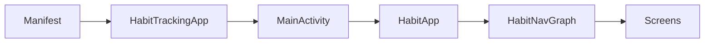
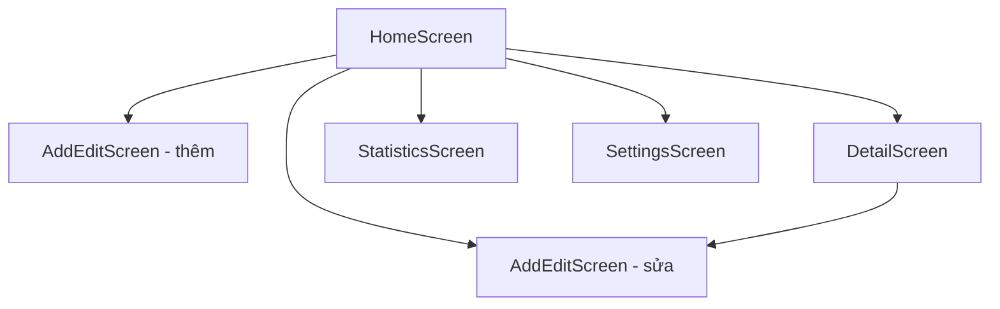
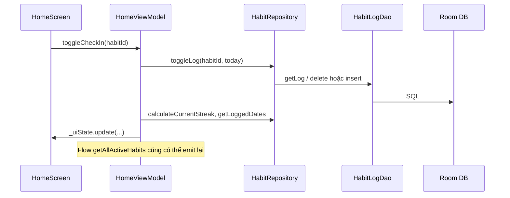

# Luồng hoạt động và cấu trúc code — Habit Tracking

Tài liệu mô tả cách app Android (Jetpack Compose + Hilt + Room) được tổ chức và dữ liệu đi qua các lớp như thế nào.

---

## 1. Tổng quan kiến trúc

App theo mô hình **một Activity**, **Compose UI**, **Navigation Compose**, **ViewModel + StateFlow**, **Repository**, **Room (DAO + Entity)**.

| Lớp | Vai trò |
|-----|---------|
| **UI (Screen + Composable)** | Hiển thị, gọi hàm trên ViewModel, thu thập `StateFlow` qua `collectAsStateWithLifecycle` |
| **ViewModel** | Giữ `UiState`, điều phối `viewModelScope.launch`, gọi `HabitRepository` |
| **HabitRepository** | API duy nhất cho domain: map Entity ↔ `Habit` / `HabitLog`, streak, toggle log, thống kê |
| **DAO** | Truy vấn Room (`Flow` hoặc `suspend`) |
| **Room DB** | File SQLite `habit_journey.db`, bảng `habits` và `habit_logs` |

**Domain model** (`domain/model/`): `Habit`, `HabitFrequency`, `HabitLog` — dùng trong UI và repository, không phụ thuộc Room trực tiếp từ UI.

---

## 2. Khởi động ứng dụng

1. **`AndroidManifest`** khai báo `android:name=".HabitTrackingApp"` → Hilt khởi tạo graph phụ thuộc toàn app (`@HiltAndroidApp`).
2. **`MainActivity`** (`@AndroidEntryPoint`): `setContent` → theme `HabitJourneyTheme` → `HabitApp()` tạo `NavHostController` → **`HabitNavGraph`**.
3. **`HabitNavGraph`**: `NavHost` với `startDestination = home`.

Luồng tóm tắt:



---

## 3. Dependency Injection (Hilt)

- **`di/AppModule`**: `@Singleton` cung cấp `HabitDatabase` (Room builder `habit_journey.db`), `HabitDao`, `HabitLogDao`.
- **`HabitRepository`**: `@Singleton` + `@Inject constructor(...)` — Hilt tự bind, không cần `@Provides` thêm.
- **ViewModel** các màn: `@HiltViewModel` + `@Inject constructor(repository)` — màn Compose dùng `hiltViewModel()`.

---

## 4. Lớp dữ liệu (persist)

### 4.1 Database

- **`HabitDatabase`**: `entities = [HabitEntity, HabitLogEntity]`, version 1.
- **`HabitDao`**: CRUD habit, lọc `isArchived = 0` cho danh sách đang hoạt động, đếm trùng tên, archive.
- **`HabitLogDao`**: log theo `habitId` + `loggedDate` (chuỗi ISO `LocalDate`), đếm theo khoảng ngày, v.v.

### 4.2 Repository

`HabitRepository` gom toàn bộ nghiệp vụ:

- Đọc habit (Flow / once), log theo habit.
- **`toggleLog`**: nếu đã có log ngày đó thì xóa, không thì insert → dùng cho home, detail, widget.
- **Streak**: `calculateCurrentStreak` (từ hôm nay hoặc hôm qua nếu hôm nay chưa log), `calculateLongestStreak` (duyệt ngày đã sắp xếp).
- **Thống kê**: `getCompletionRateLastDays`, `getLoggedDates`.
- **Mapper**: `HabitEntity` ↔ `Habit` (JSON cho `targetDays`, enum `HabitFrequency`).

---

## 5. Điều hướng (Navigation)

Định nghĩa route trong **`navigation/Screen.kt`** (sealed class). **`NavGraph.kt`** nối route với composable tương ứng:

| Route | Màn hình | Tham số |
|-------|----------|---------|
| `home` | `HomeScreen` | — |
| `add_habit` | `AddEditScreen` | `habitId = null` |
| `edit_habit/{habitId}` | `AddEditScreen` | `habitId` |
| `habit_detail/{habitId}` | `DetailScreen` | `habitId` |
| `statistics` | `StatisticsScreen` | — |
| `settings` | `SettingsScreen` | — |

**Luồng điển hình**: Home → tap habit → Detail → nút sửa → Edit → `popBackStack`. FAB/thêm mới → Add → quay lại Home.



---

## 6. Luồng theo từng màn hình

### 6.1 Home — `HomeScreen` + `HomeViewModel`

1. **`init`**: `observeHabits()` — `collect` `repository.getAllActiveHabits()`.
2. Mỗi lần danh sách habit đổi: `refreshHabitsState` — với từng habit gọi `isLoggedForDate`, `calculateCurrentStreak`, `getLoggedDates` → cập nhật `HomeUiState` (`HabitWithStatus`, `completedCount`, `totalCount`).
3. **`toggleCheckIn`**: `repository.toggleLog(habitId, today)` rồi cập nhật cục bộ state (streak, ngày đã log) để UI phản hồi nhanh.
4. **`deleteHabit` / `archiveHabit`**: gọi repository; flow habit sẽ emit lại.

### 6.2 Chi tiết — `DetailScreen` + `DetailViewModel`

1. **`LaunchedEffect(habitId)`**: `loadHabit(habitId)` — `collect` `getHabitById`; mỗi emit tính lại `loggedDates`, streak hiện tại / dài nhất, `totalLogs`.
2. Heat map / ngày: **`toggleLogForDate`** → `toggleLog` + refresh state.
3. Xóa / lưu trữ: **`deleteHabit`** / **`archiveHabit`** → repository, set `isDeleted = true` → **`LaunchedEffect(uiState.isDeleted)`** trên Screen gọi `onNavigateBack()`.

### 6.3 Thêm / sửa — `AddEditScreen` + `AddEditViewModel`

1. Nếu có `habitId`: **`loadHabit`** (once) đổ form từ `getHabitByIdOnce`.
2. Các hàm `onNameChange`, `onFrequencyChange`, v.v. chỉnh `AddEditUiState`.
3. **`saveHabit`**: validate tên, kiểm tra trùng `isDuplicateName`, build `Habit` → `insertHabit` hoặc `updateHabit` → `isSaved = true` → UI thường `popBackStack` khi saved.

### 6.4 Thống kê — `StatisticsScreen` + `StatisticsViewModel`

1. **`init`**: `loadStatistics()` — `collect` `getAllActiveHabits()`.
2. Với mỗi habit: streak, longest streak, tỷ lệ 30 ngày; tính trung bình, top streak, sort list; **8 tuần** gần nhất: với mỗi tuần cộng số log của mọi habit trong khoảng thứ Hai–Chủ nhật → `weeklyData`.

### 6.5 Cài đặt — `SettingsScreen`

- Chủ yếu UI cục bộ (theme, ngôn ngữ, thông báo, xuất/xóa dữ liệu trong dialog) — **không** dùng `HabitViewModel` chung; logic nằm trong composable / state cục bộ (theo code hiện tại).

---

## 7. Widget (Glance)

- **`HabitWidget`**: trong `provideGlance` dùng **`WidgetDbHelper`** mở **cùng file DB** `habit_journey.db` (singleton trong process widget), đọc tối đa 4 habit active, hiển thị check-in hôm nay.
- **`WidgetCheckInAction`**: toggle log trực tiếp qua DAO (insert/delete `HabitLogEntity`) rồi `HabitWidgetReceiver.updateAll` — **không** đi qua Repository/ViewModel (đường song song với app chính nhưng cùng SQLite).

---

## 8. Cấu trúc thư mục gợi ý (mã nguồn chính)

```
app/src/main/java/com/dttrn/habit_tracking/
├── MainActivity.kt          # Entry Compose + NavGraph
├── HabitTrackingApp.kt      # Application + Hilt
├── di/AppModule.kt          # Room + DAO
├── navigation/              # Screen routes + NavGraph
├── data/
│   ├── db/                  # Database, entity, dao
│   └── repository/          # HabitRepository
├── domain/model/            # Habit, HabitLog, HabitFrequency
├── ui/
│   ├── screen/              # home, detail, add_edit, statistics, settings
│   ├── components/          # HabitCard, HeatMap, StreakBadge...
│   └── theme/
└── widget/                  # Glance widget + receiver + DB helper
```

---

## 9. Tóm tắt luồng dữ liệu một thao tác “check-in hôm nay” trên Home



---

*Tài liệu phản ánh cấu trúc codebase tại thời điểm tạo file; khi thêm màn hình hoặc thay đổi repository, nên cập nhật mục tương ứng.*
